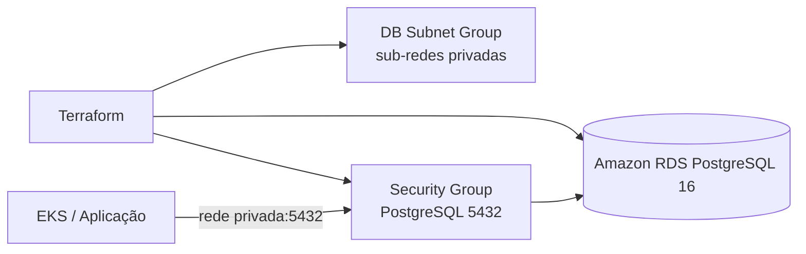

# Infraestrutura do banco de dados gerenciado

Repositório Terraform que cria o PostgreSQL RDS privado utilizado pela API da Oficina Mecânica. Ele é independente do cluster e da aplicação, mas usa a mesma VPC criada pelo repositório de infraestrutura Kubernetes.

## Arquitetura



O banco não recebe acesso público. O security group permite tráfego PostgreSQL apenas a partir do CIDR da VPC compartilhada. O RDS usa armazenamento criptografado, backups de sete dias e crescimento automático de armazenamento.

## Tecnologias e recursos

Terraform, AWS Provider, Amazon RDS PostgreSQL 16, VPC, sub-redes privadas, security groups e backend remoto S3 para o estado Terraform.

## Pré-requisitos

Terraform e AWS CLI autenticada com permissões para RDS, VPC e S3. Antes deste repositório, provisione o repositório `mechanic-shop-pos-tech-challenger-kubernetes`, pois ele fornece a VPC e as sub-redes.

## Provisionamento básico

1. Obtenha no repositório Kubernetes os outputs `vpc_id`, `vpc_cidr` e `private_subnet_ids`.
2. Crie o arquivo local de variáveis a partir do exemplo e preencha os valores. Informe a senha por `TF_VAR_database_password` ou pelo seu gerenciador de segredos; não a salve no `terraform.tfvars`.
3. Inicialize o backend remoto, revise o plano e aplique:

```bash
cd mechanic-shop-pos-tech-challenger-managed-database
copy terraform.tfvars.example terraform.tfvars
$env:TF_VAR_database_password = "<SENHA_FORTE>"
terraform init -backend-config="bucket=<BUCKET_DE_ESTADO>" -backend-config="key=mechanic-shop/rds.tfstate" -backend-config="region=sa-east-1"
terraform plan
terraform apply
```

Guarde os outputs `database_endpoint`, `database_port` e `database_name` em segredo operacional e use-os para montar a URL JDBC da aplicação. O endpoint é privado e só deve ser consumido pela rede da aplicação.

## Implantação e documentação da API

Depois que o RDS estiver disponível, configure no deployment da API as credenciais e a URL JDBC. A aplicação e seus manifests estão no repositório `mechanic-shop-pos-tech-challenger`; a documentação funcional pode ser consultada no [Swagger local](http://localhost:8080/swagger-ui.html).

Este checkout não contém workflow de CI/CD versionado. Para atender ao requisito da Fase 3, configure uma pipeline que rode `terraform fmt -check`, `validate` e `plan` em pull requests e aplique mudanças somente em branches protegidas, com senha e credenciais obtidas de secrets.
